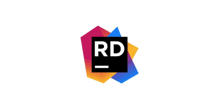

### About Me:
- <strong>Hi, I’m @TusharVaid30!</strong>
- I'm learning Unity Barracuda right now.
- I’m a game developer, and use Unity to build my games.
- I create assets and digital art using Blender.
- I've worked with AR/VR and have a project or two on the same.
- How to reach me: My email- tusharvaid30@gmail.com✉️ 
- You can check out some of my work [here](http://loopinteractive.itch.io/) 
- <strong>PS: All icons in this README are links which describe the icon, if you want to know anything about what technology/association  an icon represents, click   on it for more information!</strong>

### Communities/Clubs/Organizations: 

   <i>Syndicate at SRM NextTechLabs(KTR)</i>
 
    
    
   <i>Member of the Founding Board at Game Development Community SRM(KTR)</i>
 
 
  
   
  

   
  
  <h1 align="center">Hi! I'm Tushar Vaid!
  

 
[;I+work+with+AR+and+VR+development;Always+willing+to+learn+something+new)](https://git.io/typing-svg)

</h1>

 

 

<h3 align="left">Connect with me:</h3>

  
  
    
  

<h3 align="left">Languages and Tools:</h3>
<h5 align="left">Programming Languages</h5>
    
  
    
  
  
   
  
   <h5 align="left">Tools</h5>
   
  
  
  
  
  
      
   
    
   <a href="https://www.blender.org/download/" target="_blank">
   
  
  
  
  
   
  

  

  
  
